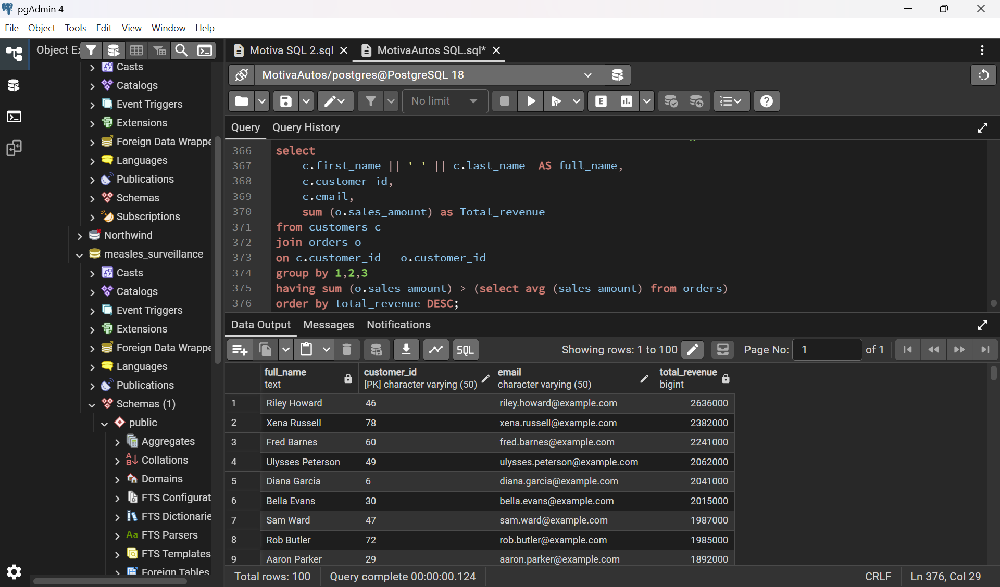

# MotivaAutos — Automotive SQL Analytics

A SQL case study demonstrating how relational automotive business data can be queried, combined and summarised to answer practical commercial and operational questions.

[View the full portfolio case study](https://mayfuns.github.io/mariam-analytics-portfolio/motivaautos.html)



## Project overview

MotivaAutos focuses on using SQL to move from raw relational tables to clear, reproducible business analysis.

The project demonstrates how structured queries can support automotive decision-making by retrieving relevant records, joining related tables, aggregating results and organising outputs around business questions.

## Business question

**How can relational automotive data be queried and combined to produce reliable business information for commercial and operational decision support?**

## Tools and SQL skills

- SQL
- Relational data analysis
- SELECT and filtering
- Sorting
- JOIN operations
- Aggregation
- GROUP BY
- Business-question-driven querying

## Analytical workflow

1. **Inspect the tables**  
   Understand the available entities, fields and relationships.

2. **Join related data**  
   Connect relevant tables to create a fuller business view.

3. **Aggregate results**  
   Summarise records and compare business segments.

4. **Interpret findings**  
   Translate query outputs into practical business information.

## What this project demonstrates

- Working with structured relational datasets.
- Understanding and using table relationships.
- Translating business questions into reproducible SQL queries.
- Combining and summarising data for decision support.
- Presenting SQL outputs in a business-focused format.

## Repository structure

```text
01_sql/
  ├── MotivaAutos SQL File.sql
  └── README.md

02_database/
  ├── schema / relationships
  └── README.md

03_data/
  ├── source or sample data where redistribution is permitted
  └── README.md

04_results/
  ├── project-preview.png
  └── query-output screenshots

05_documentation/
  └── README.md
```

## Portfolio

- [Portfolio homepage](https://mayfuns.github.io/mariam-analytics-portfolio/)
- [MotivaAutos full case study](https://mayfuns.github.io/mariam-analytics-portfolio/motivaautos.html)
- [GitHub profile](https://github.com/Mayfuns)

---

**Mariam Adetoyi**  
Data Analyst | SQL | Business Analytics
